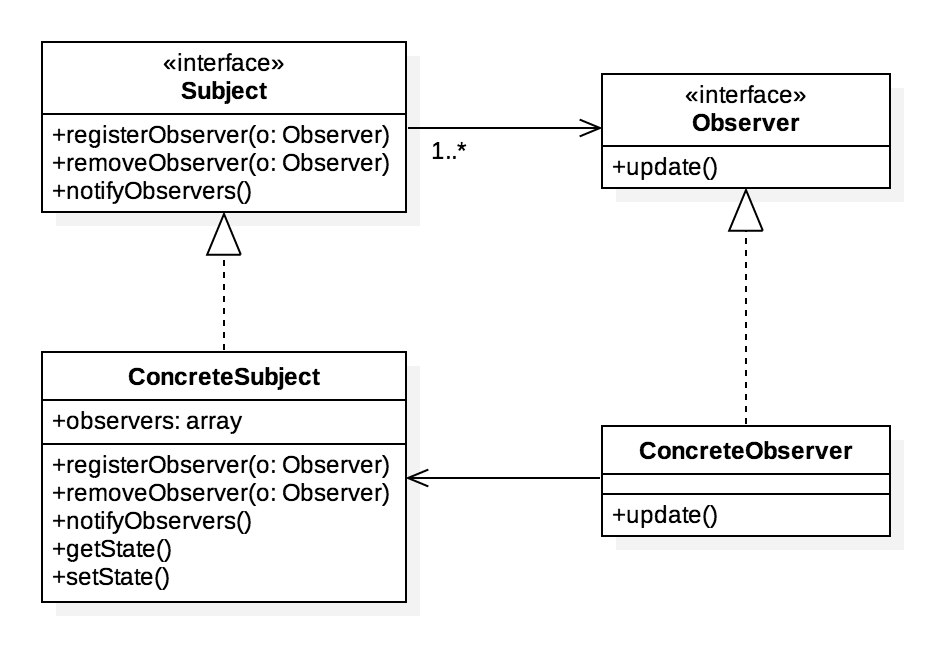

Observer Pattern
================
Defines a one-to-many dependency between objects so that when one object changes state, all its dependents are notified and updated automatically

Class diagram
-------------
