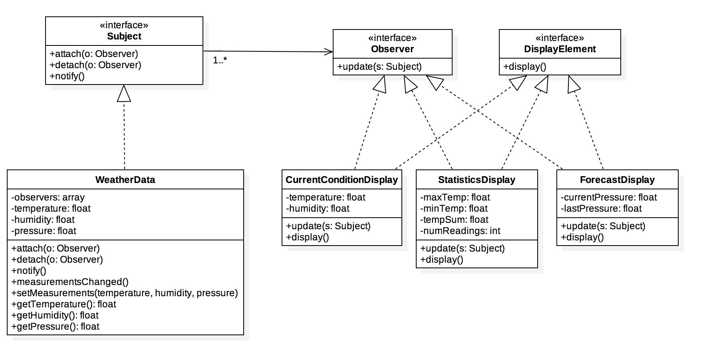

Weather Monitoring
==================
The weather monitoring will be based on patent pending WeatherData object,
which tracks current weather conditions (temperature, humidity, and pressure).
We have to create an application that initially provides three display elements:
current conditions, weather statistics, and a simple forecast, all update
in real time as the WeatherData object acquires the most recent measurements.
In addition, out application need to be expandable so that other developers can
easily write their own weather displays and plug them in.

Class diagram
-------------

    

