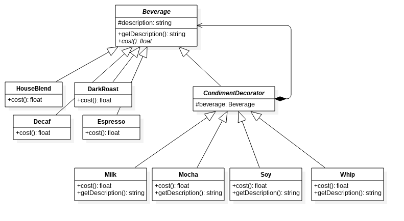
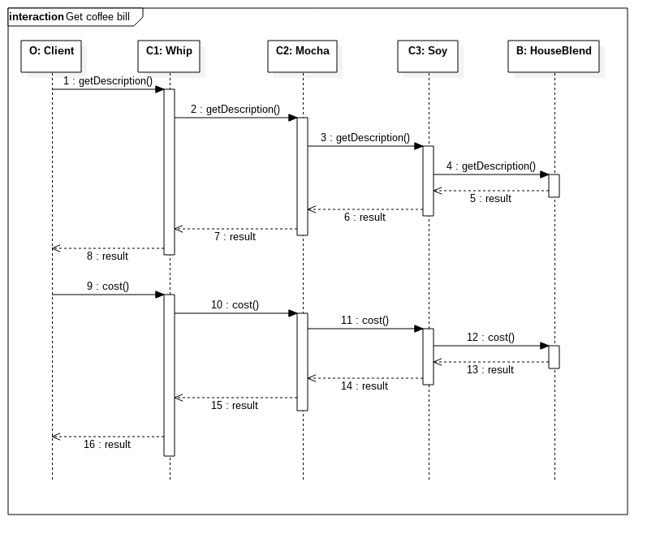

Coffee Shop
=================
A coffee shop grown so quickly, they want to update their ordering systems to match their beverage offerings. They have many coffee types and the customer can also ask for several condiments like steamed milk, soy, and mocha, and have it all topped off with whipped milk. The application get order and need to response a bill with all descriptions and the total cost of beverage and condiments. Here, we build a small part of application by applying decorator for solving this issue.

**For ex.** 
&nbsp;&nbsp;&nbsp;&nbsp;An order bill include house blend, soy, mocha, and whip will response as below: 
&nbsp;&nbsp;&nbsp;&nbsp;House Blend, Soy, Mocha, Whip: $1.34

Class diagram
-------------

    

Sequence diagram
---------------

    

