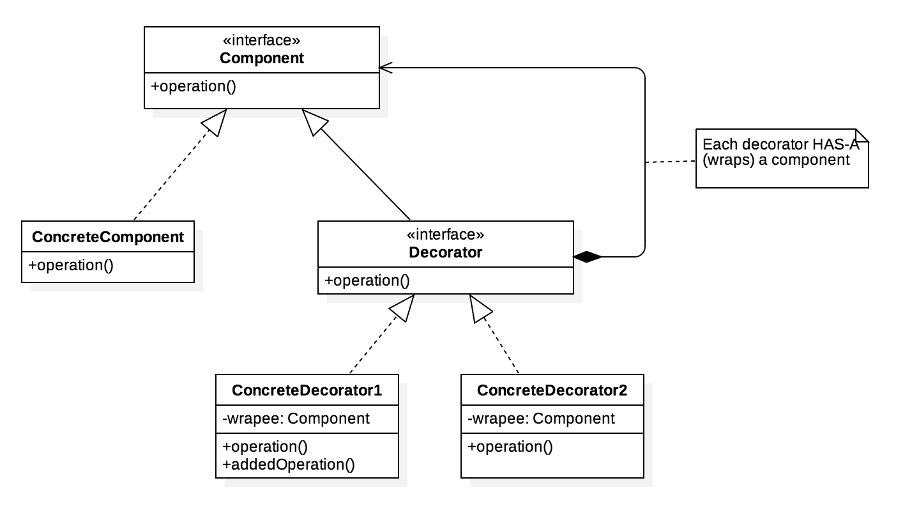
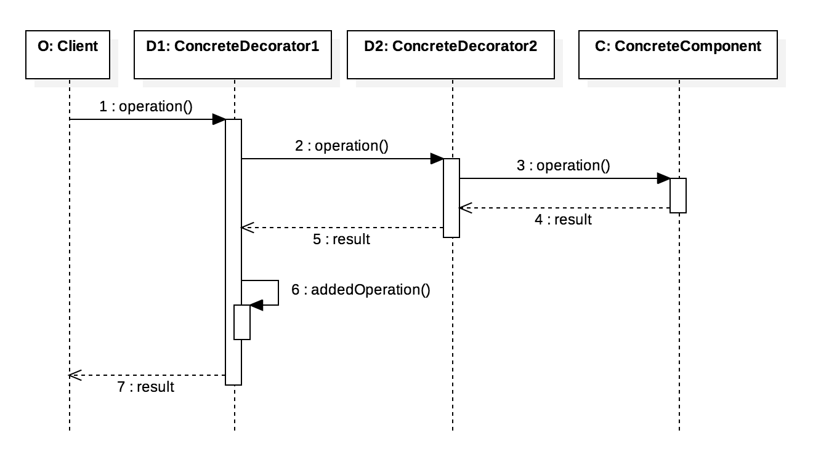

Decorator Pattern
=================
When object-oriented programming was introduced, inheritance was the main pattern used to extend object functionality. Today, inheritance is often considered a design smell. In fact, it has been shown that extending objects using inheritance often results in an exploding class hierarchy. In addition, several popular programming languages such as Java and PHP do not support multiple inheritance, which limits the benefits of this approach.

The decorator pattern provides a flexible alternative to inheritance for extending objects functionality. This pattern is designed in a way that multiple decorators can be stacked on top of each other, each adding new functionality. In contrast to inheritance, a decorator can operate on any implementation of a given interface, which eliminates the need to subclass an entire class hierarchy. Furthermore, the use of the decorator pattern leads to clean and testable code.

Class diagram
-------------

    

Sequence diagram
---------------

    

